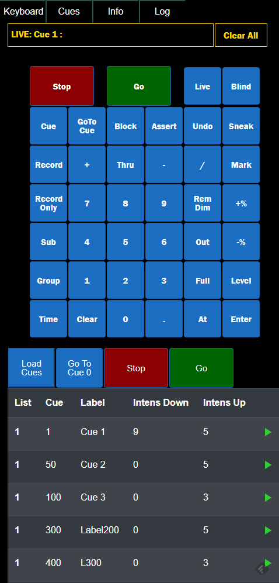

# EosWeb 

.net core based web application for working with ETC Eos over OSC.
 
Built using server side Blazor

Usage:

Configure OSC Port and Web port in the config.json file.
Start the eosweb.blazor.exe file.
Connect to the web port with any browser

Example:

